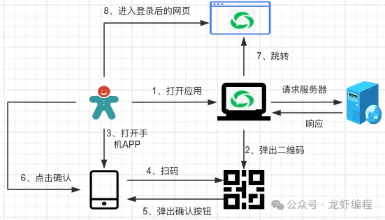
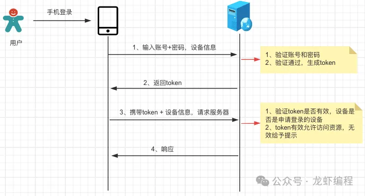
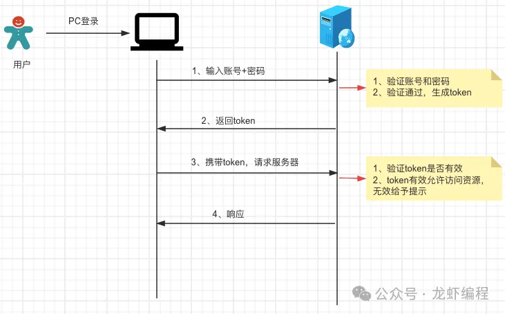
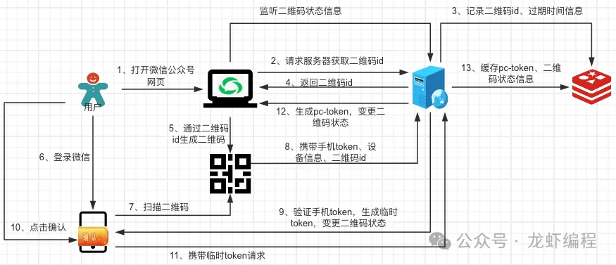
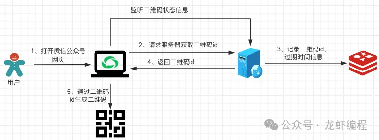
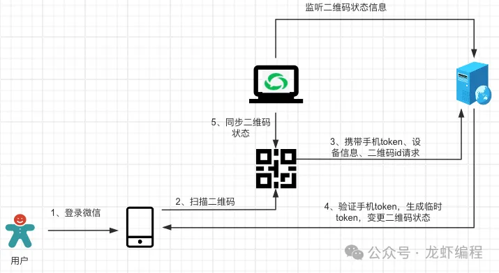
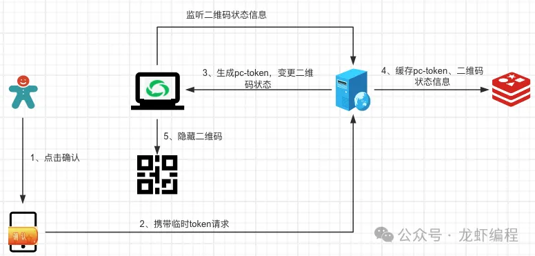

现在我们很多的应用（如微信公众号、B站网页等）都是支持手机扫码登录，在网页上打开应用后就会弹出使用手机扫码登录的页面如下：

图片

此时用户只需使用微信（微信已经是登录状态的，不然是扫描不了的）扫一下图中的二维码，随后手机上就出现了让用户点击确认登录的按钮，当用户点击确认之后就会自动登录到应用。整个流程如下图所示：

那么手机扫码登录是如何实现的呢？下面分析手机扫码登录的原理。

##1、手机登录和PC登录的原理

1.1 手机登录原理

图片

（a）用户在手机客户端上输入账号和密码并且携带设备信息一起请求服务器

（b）服务器接收到请求后，验证用户的账号和密码是否正确，如果不正确则给予异常的提示；如果正确就生成token给客户端

（c）手机客户端通过携带token和设备的信息的方式请求服务器，服务器验证token是否有效，token有效的情况下验证是否为之前申请登录的客户端设备，如果不是之前申请登录的设备也不允许访问服务器

手机登录中需要携带设备的信息是为了防止token泄露后，攻击者使用其他的设备携带当前的token访问服务器资源。

1.2 PC登录原理

图片

（a）PC端输入账号和密码请求登录服务器

（b）服务器接收到请求后，验证用户的账号和密码是否正确，如果不正确则给予异常的提示；如果正确就生成token给客户端

（c）PC端携带token请求访问服务器，服务器验证token是否有效，token有效可以处理请求并返回响应

##2、手机扫码登录的原理

了解了手机登录和PC端登录的原理后，理解手机扫码登录的原理就很简单了，手机扫码登录的实质是通过已经在APP上登录的用户帮助PC端的应用到服务器上申请pc-token，拿到pc-token后就和PC端登录服务器的原理一样了。手机扫码登录的完整流程如下：

2.1 生成二维码

    
用户打开PC端的应用后PC端会向服务器申请二维码id，服务器此时会生成一个唯一的二维码id，然后服务器将二维码id、二维码过期时间等信息存放Redis中并且返回二维码id给PC端。

    
PC端获取到二维码id后利用其生成一个用户可扫描的二维码，当然PC端需要监听到二维码的状态变更信息（服务器上对二维码的变更操作需要实时的通知PC端）。

2.2 用户扫描二维码

    
生成二维码之后，用户使用手机上已登录的APP扫描这个二维码，扫描后会发送一个携带手机token、设备信息和二维码id的请求访问服务器。

    
当服务器接收到登录请求后会验证手机token的有效性，如果手机token是有效的并且token也是当前的设备申请的，此时服务器会生成一个临时的token并修改二维码的状态为等待用户确认登录的状态，然后返回token信息给手机客户端，手机客户端此时会弹出用户确认的按钮。与其同时服务器会通知客户端当前的二维码状态处于等待用户确认登录的状态。

2.3 用户手机上确认登录

    
用户在手机上点击确认登录后会发送一个携带临时token的请求到服务器上，服务器验证临时token是否有效，如果临时token是有效的，服务器就会生成一个pc-token以及修改二维码的状态为登录状态的一系列操作。服务器将pc-token和二维码状态等信息缓存到Redis中，然后服务器还要推送pc-token和二维码变更信息到PC端，PC端感知到二维码状态变更之后就隐藏二维码和跳转到主页中。

    
通过以上的步骤就是实现了一套完整的手机扫码登录流程，在这个过程中每次的二维码信息变更都是服务器推送给PC客户端的，那么服务器如何做到推送数据给PC客户端呢？这里实现服务器和客户端通信的方案有很多种，如常见有WebSocket、SSE和客户端轮询等方案，龙虾之前也有过分享服务端和客户端实时通信的文章，有兴趣的朋友可以点击看下

整理常见的实时消息推送方案

总结：

（1）手机扫码登录中二维码的状态变更涉及到服务器和客户端之间的通信问题，有多种实现方案

（2）手机扫码登录中核心是已在APP上登录的用户使用APP帮助PC客户端拿到服务器颁发的pc-token来实现PC端的登录