#1、整体的秒杀设计

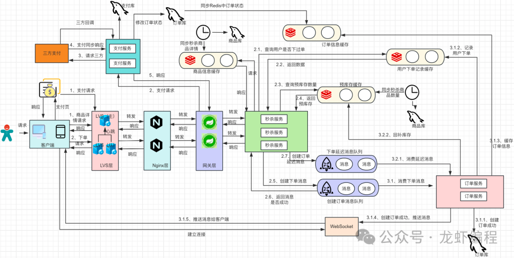

秒杀系统中我们使用了LVS和Nginx来扛住第一波流量，并且在Nginx做一波限流控制；然后Nginx将请求转发到网关上，由网关将请求分发到处理服务器上（秒杀服务），接下来由处理服务器做相关的操作。下单中使用的是异步下单加WebSocket推送下单成功的消息到客户端上，使用Redis缓存来缓存商品信息、预库存信息和用户下单成功之后的订单信息。

##2、定时上架商品和预库存
在秒杀活动中为了提高秒杀系统的性能，将秒杀商品、商品的库存信息提前添加到Redis中。

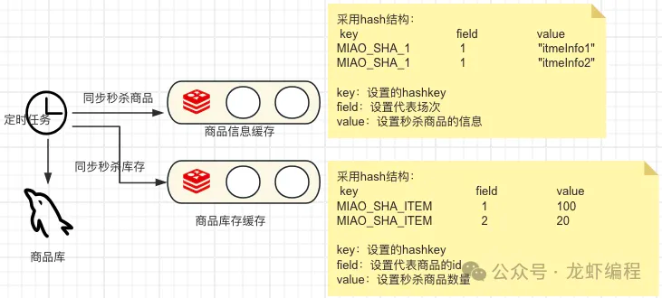

在秒杀活动的当天凌晨，将秒杀商品信息和库存都放到Redis中缓存起来，由于每场秒杀活动有不同的商品，所以针对不同的场次将商品信息使用Hash数据结构缓存起来。

##3、秒杀商品展示
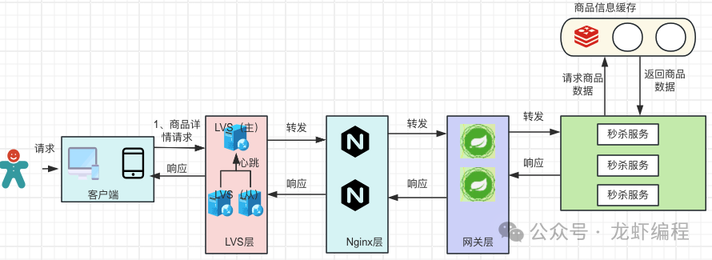
秒杀活动开始的时候，用户访问商品的页的时候，直接从redis中将缓存的商品信息给用户，这样就不用走数据库查询，提高了系统的吞吐量。

##4、用户下单
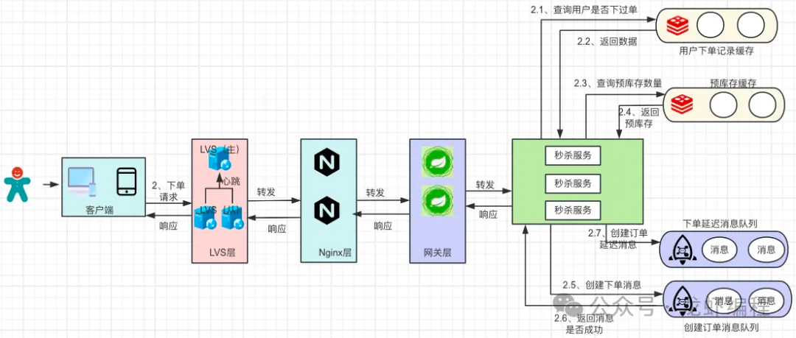

###4.1 每场每个商品用户只能下一单的处理
用户下单的时候，首先的要去判断一下用户本场是否已经下过单（限定每场活动的每个商品用户只能买一件，防止某个用户同时多个请求来到秒杀系统，为此在Redis中增加一个Set数据结构来记录用户本场针对某个商品已经下过单。如果Set中存在了本场次当前商品已经下过单就不可以让用户继续下单，反之可以下单。

 但是高并发下此方式不能完全避免用户多次下单的问题，如下：
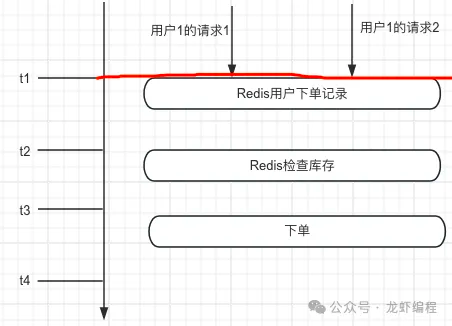
 
在t1时刻，两个线程同时请求用户的下单，此时发现没有当前的用户没有下单，放行两个线程到库存检查这一步，此时如果库存足够会让线程下单，那么就造成了同一个用户针对这个商品就多次下单了。解决方案就是在数据库中增加一个唯一键来兜底。唯一键可以使用时间+商品的id+场次来定义，如果数据插入失败就需要回补库存到Redis中。

###4.2 库存预库存
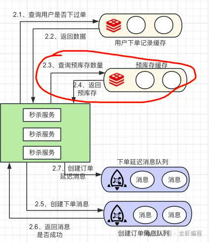

商品的预库存主要作用是阻挡大部分的无效请求，因为秒杀商品往往数量比实际用户的请求数量小很多（如秒杀商品100个，用户在某个时间段中来了500个请求，此时真正要处理的请求其实就是100个，其余的400个请求多是多余的请求，因为库存不足无法下单），使用预库存可以让无效请求直接返回而不需要到订单服务中的处理。

如果存在用户下单后没有付款或者同一个用户多个请求的情况下，会出现预库存被占用导致想要购买的用户无法下单，此时需要回补预库存。回补库存我们直接采用将数据库的剩余库存数量直接放入到预库存队列中。

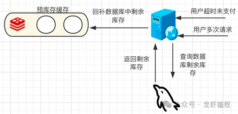图片

高并发这种方案可能会出现预库存数量比实际真实的剩余库存要多的情况，如下：

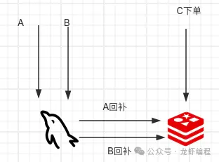图片

A线程和B线程回补库存的时候，此时发现真实库存是100个，B线程CPU的时间片恰好用完了，A线程首先执行回补100个库存到Redis，然后C下单成功后扣减了1个预库存，随后B线程获得了时间片，然后将100库存又回补到Redis中，此时真实的库存其实是99个，但是B线程回补多1个预库存；针对这种情况需要数据库层做兜底来保证不会超卖（创建订单的时候兜底处理）。

4.3 用户异步下单

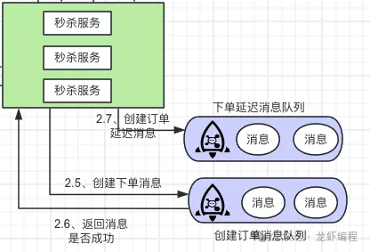

如果用户在本场本商品没有下单，并且预库存扣减成功（实质是利用Redis的自减操作，如果自减后的结果大于0就库存是足够的）那么允许用户下单，此时我们利用MQ来异步下单。

MQ会发送两个消息，一个是实时的下单消息，一个是延迟的检查规定时间用户是否支付的消息（如果超时未支付就取消本单，并且回补预库存）；MQ消息发送成功之后通知客户已经在下单队列中等待处理。

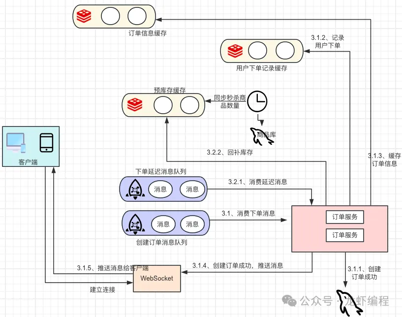图片

订单服务开始消费消息队列中的消息，首先会创建订单基本的信息、下单的商品信息等，创建成功之后订单信息会保存到数据库中并且数据还会同步一份到Redis中用于用户查询订单的信息。最后通过WebSocket技术将用户下单的成功的消息推送给客户端，方便用户支付。

给用户创建订单的时候底层需要使用乐观锁机制，先去扣减秒杀商品的库存（如update item set stock = stock - 1 where id = #{itemId} and stock > 0），如果扣减影响行数大于0，那么就代表扣减库存成功，可以让用户下单，这样可以保证商品不被超卖。

延迟消息（如延迟15分钟）过来之后，查询一下当前订单是否已经被支付，如果订单没有支付就将订单的状态修改成交易关闭。在修改订单的状态的中，极端情况下出现超时未支付的请求和用户支付请求同时来操作订单，如下：

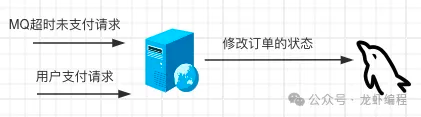

此时如果不做预防措施，订单就会出现状态错乱的现象，为了解决这个问题，采用订单的状态机来处理。如下状态的转换：

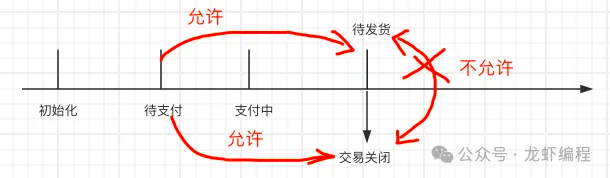

超时未支付的请求和用户支付请求谁先操作谁为准（底层的Sql语句：update order set status = #{status} where order_id = #{orderId} and status = '待支付'），这样另一个线程的就操作失败，我们需要打印日志抛出异常提示。

##5、订单支付

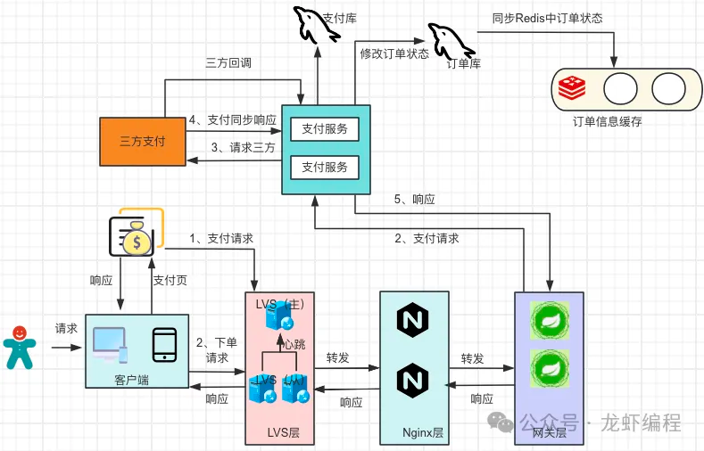

服务端创建订单成功之后，用户开始支付，支付走三方（如支付宝、微信）支付成功后需要及时修改订单的状态和同步Redis中订单的状态。

总结：

（1）秒杀系统设计中采用LVS+Nginx方式来提高系统的并发能力

（2）采用将商品信息、商品库存缓存Redis的方式来提高系统的响应和拦截无效的请求

（3）通过异步下单（MQ）的方式来给流量消峰处理，维持系统的稳定

（4）采用WebSocket的方式将下单成功的消息推送给客户端

（5）超卖问题采用乐观锁的机制做兜底处理

（6）针对用户超时未支付或者多次下单同一个商品导致商品少卖的问题，采用真实库存回补的方式来处理预库存（Redis的中的库存）

